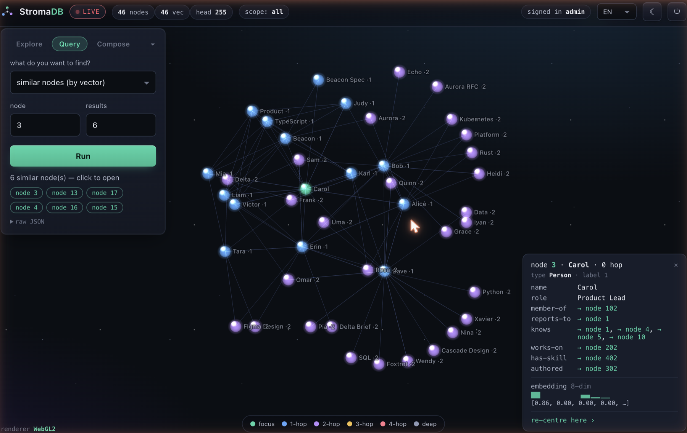
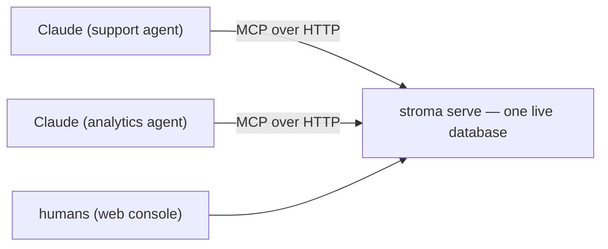

# StromaDB

**StromaDB** is a source-available, Rust **real-time GraphRAG engine optimized for LLMs**:
it fuses **meaning (vectors) × structure (typed graph) × time (bitemporal)** so an LLM can retrieve
relevant, structurally-correct, point-in-time context in low-ms — over a graph that is updated by a
live stream.



<sub>The built-in console at `http://localhost:7687/`: explore a neighbourhood, run an as-of read, a
timeline, or a rule evaluation, import a CSV, and inspect a node down to its embedding — all live.</sub>

## Try it in 60 seconds

```bash
docker run -p 7687:7687 ghcr.io/katsut/stromadb:latest --demo
# or, with a Rust toolchain (compiles from source, takes a few minutes):
cargo install stromadb && stroma up --demo
```

`--demo` boots a self-contained sample org graph — people, departments with transfers, releases
with planted approval violations, docs with embeddings — and prints everything to explore it:

- the **console URL** and login,
- three copy-paste queries for the console's Query tab:
  **as-of** (*which department was Alice in on 2024-09-01?*), **timeline** (*who was her manager,
  over time — three intervals*), and **rule verdicts** (*one clean approval, a self-approval, a
  stale approval, a missing sign-off*),
- a ready-to-paste **`claude mcp add` command** with a minted bearer token, so your agent talks to
  the same live graph immediately.

The demo lives in its own directory under the OS temp dir and seeds only an empty database —
restarting never duplicates anything.

## One server, many agents

`stroma serve` (or `stroma up`) is a standalone server: the HTTP API, the web console, and an MCP
endpoint (`POST /mcp`) run against one live database, so **N agents and the humans share the same
graph** — and see each other's writes immediately.



Give each agent its own identity with a token registry (`--tokens tokens.json`):

```json
{"tokens":[
  {"name":"support-agent","token":"...","labels":15},
  {"name":"auditor","token":"...","read_only":true}
]}
```

- a named token's writes carry its name as **provenance** — *which agent said this* is queryable,
  and agreement between different agents counts as corroboration in confidence signals;
- `labels` caps what the token can read (ABAC bitmask, intersected with each request — a client can
  narrow itself, never widen);
- `read_only` tokens get a clear 403 on any write.

For a single-process/offline setup, `stroma-mcp --db ./mydb` speaks MCP over stdio against the
directory directly (one process at a time — the directory is locked while a server runs).

## Load your own data

**CSV** — in the console's **Import** tab: drop a file, pick each column's role (property / row id /
edge / `valid_from` / `valid_to` / skip), and rows become typed facts. Date columns map onto
valid time, so as-of and timeline queries work on your data immediately. The CLI twin:

```bash
stroma import people.csv --db ./mydb --type Person --id id \
  --valid-from hired --valid-to left --edge dept:Department:member-of --source hr
```

Node ids are a deterministic hash of `(type, row id)`: re-importing the same file is a no-op, and
files that share key values line up in one graph.

**JSONL** — the full wire format (schema, nodes, facts with valid-time and provenance, rules):

```bash
stroma init --db ./mydb
cat > data.jsonl <<'EOF'
{"type_def":{"name":"Person"}}
{"type_def":{"name":"Project"}}
{"pred_def":{"name":"works-on","cardinality":"many","domain":"Person","range":"Project"}}
{"pred_def":{"name":"age","cardinality":"one","domain":"Person","range_value":"int"}}
{"node":{"id":1,"type":"Person"}}
{"node":{"id":2,"type":"Project"}}
{"fact":{"subject":1,"predicate":"works-on","object":{"node":2}}}
{"fact":{"subject":1,"predicate":"age","object":{"int":34}}}
EOF
stroma ingest data.jsonl --db ./mydb     # durable (fsync per chunk), typed, validated

echo '{"node":1,"vector":[1.0,0.0,0.0,0.0]}' > emb.jsonl
stroma embed emb.jsonl --db ./mydb       # embeddings are received, never computed

stroma query point 1 age --db ./mydb                     # {"one":{"int":34}}
stroma query expand 1 works-on --db ./mydb               # {"nodes":[2]}
stroma stats --db ./mydb
```

The database directory holds only the authoritative inputs (changelog WAL, schema/node assignments,
received embeddings); derived stores (the vector index) rebuild on open. See **[SPEC.md](SPEC.md)**
for the complete ingest and query contract.

## Why

Real-time LLM retrieval needs a graph that ingests a stream instantly and answers
**type-aware hybrid** queries cheaply. Existing options don't fit this shape:

- Vector DBs are **type-blind** — they return semantically near but structurally wrong results
  (a "Python" skill, doc, and person all look alike to pure ANN).
- Property graphs (Neo4j/…) are batch-oriented, not stream-native.
- `Postgres + pgvector` splits meaning from structure across separate I/O paths and contends on
  stream updates.

StromaDB is built for LLM retrieval: stream-native, vector + typed-graph + bitemporal, low-cost.
It targets the **bounded scale of a single organization**, which is what makes low-cost *and*
high-performance achievable at once: the hot working set fits in memory, the footprint is small,
and idle tenants can scale to zero.

## Core capabilities

- **Type-aware hybrid search** — ANN candidates filtered/reranked by graph type, so disjoint-type
  mis-fusion is rejected.
- **Bitemporal facts** — every fact carries a valid-time interval and a transaction time.
  **As-of** reads answer *what was true at instant T*; the **timeline** op answers *over which
  intervals was it true* through a chain of hops; late corrections re-slice history instead of
  corrupting it.
- **Declared rules, live verdicts** — declare a rule once (*an issue's approver must be its
  department's manager as of the approval instant, and must differ from its author*) and read
  deterministic per-subject verdicts (`OK` / `MISMATCH` stale|wrong / `ABSENT`), maintained
  **incrementally** as writes land (measured 100–1800× cheaper than re-evaluation).
- **Provenance & confidence** — facts name their source; reads surface it with a coarse confidence
  tier (corroboration, freshness), and multi-hop answers carry a **weakest-link** tier naming the
  bottleneck hop.
- **Typed property graph** — typed edges with per-edge **properties** (a level, a role, an
  allocation), minimal constraint validation at ingest (domain/range, cardinality).
- **Stream ingest, no write stalls** — append-only changelog; explicit backpressure under overload;
  no-op suppression keeps the log growing with change, not observation frequency.
- **Composable operator query IR** — `point / type-ANN / expand / filter / top-k` composed as a
  pipeline; standing queries maintained incrementally.
- **No internal model** — a deterministic retrieval/query layer; the LLM is always the caller.
  Model-written values are stored as `derived` with provenance, distinct from asserted facts.

See **[SPEC.md](SPEC.md)** for the capability/constraint contract,
**[docs/ARCHITECTURE.md](docs/ARCHITECTURE.md)** for the design, and
**[docs/DECISIONS.md](docs/DECISIONS.md)** for *why* the engine is shaped this way — the decision
trail with the measurements that settled each call (and the known limitations / roadmap).

## Console (web UI)

One dependency-free HTML file, no build step, served at `http://localhost:7687/`. A GPU-rendered
(WebGL2) graph explorer with four peer modes:

- **Explore** — walk a node's neighbourhood with live force layout; inspect any node down to its
  embedding, provenance, and confidence chips.
- **Query** — point (with **as of**), expand, node detail, similar-by-vector, **timeline**
  (interval bars over a hop chain), and **conformance** (verdict counts + gap rows).
- **Compose** — chain primitives (source → expand → filter → top-k) step by step.
- **Import** — CSV → column roles → typed facts, with valid-time mapping and conflict warnings.

The graph updates in place as the database changes (a red **LIVE** indicator shows when a stream is
feeding it). Session login, light/dark themes, and EN / JA / ZH are built in.

## Serve (HTTP)

```bash
stroma serve --db ./mydb --addr 127.0.0.1:7687   # or: stroma up  (init-if-missing + serve)

curl -s localhost:7687/health
curl -s -X POST localhost:7687/query  -d '{"op":"point","subject":1,"predicate":"age"}'
curl -s -X POST localhost:7687/query  -d '{"op":"timeline","subject":1,"hops":["member-of","manager-of"]}'
curl -s -X POST localhost:7687/query  -d '{"op":"conformance","rule_name":"release-approval"}'
curl -s -X POST localhost:7687/ingest -d '{"fact":{"subject":1,"predicate":"works-on","object":{"node":2},"props":{"role":"lead"}}}'
curl -s localhost:7687/stats
```

Settings come from flags or environment variables (flag > env > default) — see
**[docs/CONFIGURATION.md](docs/CONFIGURATION.md)** and `.env.example`. Reads are authz-scoped
(`allowed_labels`, capped per token) and stamped with an `as_of` version vector. The `stroma-serve`
binary still ships and behaves identically to `stroma serve`.

Docker, without a local Rust toolchain:

```bash
docker run -p 7687:7687 -v stroma-data:/data ghcr.io/katsut/stromadb:latest
# docker compose up   — builds locally, serves on :7687, persists in a volume
```

## Performance (measured, reproducible)

Single node, single thread, in-process. Synthetic clustered 768-d vectors (bge-class distribution),
Apple M-series laptop. Every row reproduces with one command from `crates/stroma-core/examples/`.

| What | Result | Reproduce |
|---|---|---|
| Hybrid read — vector top-10 + type/label filter + 1-hop expand, **while durably writing** | **p50 0.86 ms / p99 1.84 ms** @ 0.5M docs | `--example c2b_integrated` |
| Write → query-visible (durable fsync + vector add + consistent view refresh) | **single-digit ms**; view refresh is O(changed keys), not O(state) | `--example c2b_integrated` |
| Filtered recall@10 @ 50% type selectivity (overlapping-cluster data, exact re-rank) | **~0.99–1.0** at ~1 ms warm p99 | `--example ann_nprobe_curve` |
| Incremental rule-verdict maintenance | **1.6–16.5 µs/write** vs 171 µs–29.9 ms full re-eval (1K→100K subjects) | `--example conformance_ivm` |
| Cold-start recovery (RTO) | **0.81 s for 5M facts**; torn-write → **0 data loss** | `--example durability_slo` |
| Ingest (append + group-commit fsync) | **~7M facts/s** | `--example durability_slo` |
| Hot-tier memory | **96 B/vector** PQ codes (32× vs raw f32); the raw re-rank tier is cold/SSD-able | `--example ann_slo` |

Notes: numbers are from our runs on the hardware above — run the examples on yours. Tail latencies
(p99) are reported, not just medians. No vendor comparisons here; see
[docs/DECISIONS.md](docs/DECISIONS.md) for known limitations (single-threaded serving, cold-SSD
re-rank caveat) and the roadmap.

## Status & license

Pre-1.0, single-node, under active development. Core engine implemented and measured: durable
changelog (framed WAL, group-commit fsync, compaction), IVF-PQ vector index with exact re-rank and
drift detection, typed hybrid reads, bitemporal as-of + timeline reads, incrementally maintained
conformance verdicts, a composable query IR, and the unified `stroma` binary (CLI + server + console
+ MCP). Source-available under the **Elastic License 2.0** — free to use, embed, and modify; the
restriction is offering it as a managed service.
