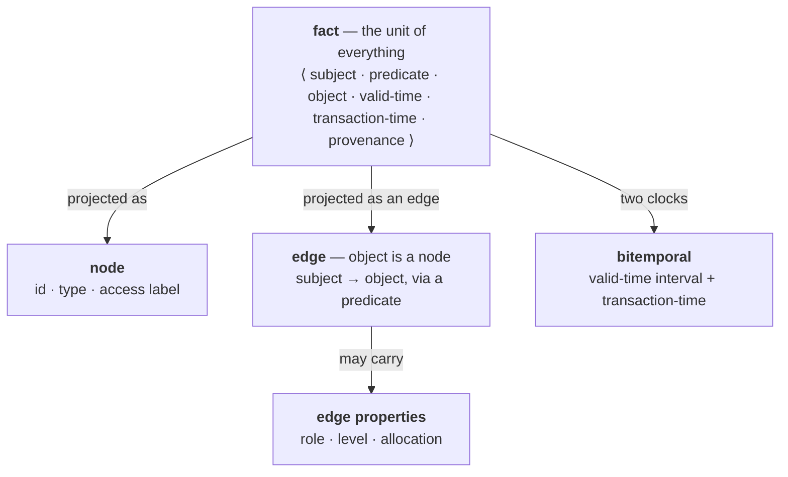

# StromaDB — Specification

StromaDB is a source-available, single-node **real-time GraphRAG engine optimized for LLMs**. It
fuses **meaning** (vectors), **structure** (a typed property graph), and **time** (bitemporal facts)
into one store, so an agent can retrieve relevant, structurally-correct, point-in-time context in
low-ms over a graph that a live stream keeps updating.

This document specifies the **data model**, the **JSONL ingest wire format**, the **query API**
(request/response shapes per operation), and the **consistency, access-control, and durability**
guarantees. It is the contract an integrator builds against. Companion: [`docs/ARCHITECTURE.md`](docs/ARCHITECTURE.md)
(engine internals) and [`docs/DECISIONS.md`](docs/DECISIONS.md) (rationale, limits, measurements).

---

## 1. Data model

Everything is a **fact**:

```
fact = ⟨ subject, predicate, object, valid-time, transaction-time, provenance ⟩
```

Nodes and edges are **projections** of this one unit:



- **Subjects** are node ids (`u64`). **Objects** are either another node (an edge) or a typed literal
  (int, float, text, bool).
- **Nodes and edges are projections of facts.** A node carries a `type` and an access-control
  `label`; an edge is a `(subject, predicate, object)` fact and may carry its own **edge properties**
  (a level, a role, an allocation) in a separate store.
- **Predicates are declared** in a bounded catalog. Each predicate fixes a **cardinality**
  (`one` = functional, last-writer-wins; `many` = a set), a **domain** type, a **range** (a node type
  or a literal type), and optional **relationship properties** (`symmetric`, `transitive`, `inverse`).
  The catalog is a **lightweight ontology** — types, domain/range, cardinality, relation properties —
  deliberately **without axioms or a reasoner**; the engine holds only minimal domain/range and
  cardinality validation.
- **Bitemporal.** Every fact has a **valid-time** (true-in-the-world interval) and a **transaction-time**
  (when it was recorded). Superseding a `one`-predicate closes the prior valid-time interval instead of
  destroying it, so history stays queryable and any instant can be read *as of* a valid-time (§4).
- **Provenance.** Each fact may name a `source`; reads can surface it and derive a coarse confidence
  from it (§3, `point`).

---

## 2. Ingest — JSONL wire format

Ingest is a batch of **newline-delimited JSON records**, one per line, applied in order. A batch is
**durable on return** (fsync'd to the changelog). Records are of these kinds:

### Schema records

```jsonc
{"type_def":   {"name": "Person"}}
{"source_def": {"name": "hr"}}
{"pred_def":   {"name": "name",       "cardinality": "one",  "domain": "Person", "range_value": "text"}}
{"pred_def":   {"name": "reports-to", "cardinality": "one",  "domain": "Person", "range": "Person"}}
{"pred_def":   {"name": "member-of",  "cardinality": "many", "domain": "Person", "range": "Team",
                "inverse": "has-member"}}
```

- `type_def.name` — register a node type.
- `source_def.name` — register a provenance source (optional; a `fact.source` also auto-registers).
- `pred_def` — declare a predicate. `cardinality` is `one` or `many` (default `many`) and is
  **load-bearing**: it cannot later be redefined to a different cardinality. `domain` is a type name.
  The range is a node type via `range` **or** a literal type via `range_value`
  (`text` | `int` | `float` | `bool`, default `text`). Relationship properties `symmetric` /
  `transitive` (bools) and `inverse` (the name of another predicate; may be a forward reference) are
  evaluated at query time by `expand` and are never materialized.

### Data records

```jsonc
{"node": {"id": 1,  "type": "Person", "label": 1}}
{"node": {"id": 10, "type": "Team"}}
{"fact": {"subject": 1, "predicate": "name",       "object": {"text": "Ada"}, "source": "hr"}}
{"fact": {"subject": 1, "predicate": "reports-to", "object": {"node": 2},
          "valid_from": 1704067200, "source": "hr"}}
{"fact": {"subject": 1, "predicate": "member-of",  "object": {"node": 10}, "props": {"role": {"text": "lead"}}}}
{"retract": {"subject": 1, "predicate": "member-of", "object": {"node": 10}}}
{"close": {"subject": 1, "predicate": "reports-to", "valid_from": 1704067200, "source": "hr"}}
```

- `node` — `id` (required); optional `type` (a declared type) and `label` (a `u64` ABAC bitmask, §5).
- `fact` — assert `(subject, predicate, object)`. `object` is a typed value (below). Optional
  `valid_from` / `valid_to` (epoch seconds; the valid-time interval, default `[0, ∞)`), `source` (a
  provenance name), and `props` (edge properties, a map of name → typed value).
- `retract` — end a `many`-predicate membership (`subject, predicate, object`; optional `source`).
  Retracting an edge that is not present is a no-op (not counted). A `retract` on a `one`-predicate
  is an error: supersede the value by asserting a new one, or end it with `close`.
- `close` — end a `one`-predicate's value with no successor (`subject, predicate`; optional
  `valid_from`, default `0`, and `source`). The current value becomes absent, and an as-of read at or
  after `valid_from` returns nothing (reads before it still see the prior value) — regardless of
  arrival order. Errors on a `many`-predicate (use `retract`).

### Object / literal encoding

An `object` (and any `props` / `equals` value) is a single-key object naming its type:

```jsonc
{"node": 2}          // a reference to node 2 (an edge)
{"int": 42}
{"float": 3.5}
{"text": "Ada"}
{"bool": true}
```

### Named rules

A conformance rule (§3) can be stored by name for reuse:

```jsonc
{"rule_def": {"name": "manager-name-current", "rule": { /* see conformance */ }}}
```

---

## 3. Query API

A query is a JSON object whose `op` field names the operation. The same operations are exposed over
the HTTP surface (`stroma-serve`), the `stroma` CLI, and as MCP tools (`stroma-mcp`, where the tool
name is the `op`). Reads are **authz-scoped** (§5) and stamped with an `as_of` cut (§4).

### `schema`

Discover what is queryable.

```jsonc
// request
{"op": "schema"}
// response
{"predicates": [{"name": "reports-to", "card": "one",
                 "domain": "Person", "range": {"type": "Person"}}, …],
 "labels": [1, 2, …]}
```

### `point`

Read the value(s) of a `(subject, predicate)`.

```jsonc
// request — current value
{"op": "point", "subject": 1, "predicate": "reports-to"}
// request — as-of a valid-time instant, and/or with a freshness reference
{"op": "point", "subject": 1, "predicate": "reports-to", "valid_at": 1704067200}
{"op": "point", "subject": 1, "predicate": "name", "now": 1720000000, "max_age": 2592000}
```

- A `one`-predicate returns `{"one": <value>}`; a `many`-predicate returns `{"many": [<value>, …]}`.
- `valid_at` reads the value **in effect at instant T** (valid-time as-of) rather than the latest write.
- For a **current** `one`-value, the response additively carries the winning version's `valid_from`,
  provenance, and a coarse confidence:

```jsonc
{"one": 2,
 "valid_from": 1704067200,
 "provenance": "hr",
 "confidence": {"tier": "high|medium|low", "corroboration": 2, "sources": 2, "age": 120}}
```

`tier` is `low` if the value has no source or is stale (`age > max_age`), else `high` if corroborated
by ≥ 2 distinct sources, else `medium`. `corroboration` / `sources` / `age` are the raw signals, so a
caller can apply its own policy. `age` appears only when `now` is supplied; `valid_from` and
`confidence` are **omitted** for an as-of (`valid_at`) or absent read, leaving the shape unchanged.
`valid_from` lets a writer compare an incoming event's timestamp against the current winner before
writing (late-arrival detection).

### `expand`

One-or-multi-hop neighbourhood via a predicate, honouring its relationship properties.

```jsonc
// request
{"op": "expand", "subject": 1, "predicate": "member-of", "max_depth": 16}
// response
{"nodes": [10, 11, …]}
```

`symmetric` predicates traverse undirected, `inverse` follows the named reverse predicate, and
`transitive` walks a bounded closure (`max_depth`, default 16).

### `search`

Type-aware hybrid search: k nearest nodes of a type to a query vector, authz-scoped, optionally
1-hop expanded.

```jsonc
// request
{"op": "search", "type": "Doc", "vector": [0.12, …], "k": 10,
 "allowed_labels": 3, "expand": "mentions", "mode": "fresh"}
// response
{"ids": [7, 3, …], "scores": [0.91, …],
 "as_of": {"changelog": 10432, "vector": 10400}}
```

ANN candidates are filtered/reranked by graph type and structure, so an approximate index and a type
filter don't collapse recall. `mode` is `fresh` (each store at latest + a brute-force scan of the
un-indexed tail; the agent default) or `strict` (all stores at a single consistent watermark; §4).

### `conformance`

Evaluate a declared rule into a **deterministic verdict per subject**.

```jsonc
// request — inline rule, or {"rule_name": "manager-name-current"}
{"op": "conformance",
 "rule": {
   "subject_type": "Person",
   "scope":       {"predicate": "member-of", "equals": {"node": 10}},
   "required":    {"hops": [{"predicate": "reports-to"}, {"predicate": "name", "as_of": "review-time"}]},
   "actual":      "manager-name",
   "absent_when": {"predicate": "employment-status", "equals": {"text": "active"}}
 }}
// response
{"verdicts": [
  {"subject": 1, "verdict": "OK",             "kind": null,    "required": "Grace", "actual": "Grace", "as_of": 1704067200},
  {"subject": 2, "verdict": "MISMATCH",       "kind": "stale", "required": "Lin",   "actual": "Ada",   "as_of": 1701388800},
  {"subject": 5, "verdict": "ABSENT",         "kind": null,    "required": "Ivy",   "actual": null,    "as_of": null},
  {"subject": 9, "verdict": "NOT_APPLICABLE", "kind": null,    "required": null,    "actual": null,    "as_of": null}
]}
```

- `required.hops` is a path of `one`-predicates walked from each subject to derive an expected value;
  a hop may be read **as-of** a valid-time anchor named by the `as_of` predicate on the subject.
- The derived value is compared to the subject's `actual` predicate:
  - `OK` — present and equal.
  - `MISMATCH` — present but unequal; `kind` sub-classifies via valid-time history as `stale` (was
    once correct) or `wrong` (never correct).
  - `ABSENT` — `actual` is missing where `absent_when` says it should exist.
  - `NOT_APPLICABLE` — the subject falls outside `scope`.

This composes a multi-hop, as-of check the caller would otherwise assemble by hand — deterministically,
post-authz, with no reasoner.

### `completeness`

Report, per node of a type, the required predicates that are **absent**.

```jsonc
// request
{"op": "completeness", "type": "Issue", "required": ["assigned-to", "due-date"]}
// response
{"incomplete": [{"node": 12, "missing": ["due-date"]}, …]}
```

Deterministic (sorted by node id, `missing` in request order), authz-scoped; nodes with every required
predicate present are omitted.

### `edge_props`

Read the properties on a specific edge.

```jsonc
// request
{"op": "edge_props", "subject": 1, "predicate": "member-of", "object": {"node": 10}}
// response
{"props": {"role": "lead"}}
```

### `stats` / `ingest`

- `{"op": "stats"}` → engine counters: durable changelog head, schema/embedding counts, storage bytes.
- Ingest (§2) is submitted as a JSONL batch and returns
  `{"defs": D, "nodes": N, "facts": F, "retracts": R, "closes": C, "durable_head": H}`, durable on
  return. `retracts` counts only retracts that removed a present edge.

---

## 4. Time & consistency

- **Two clocks.** *Valid-time* (true-in-the-world) is what `valid_from` / `valid_to` set and what
  `valid_at` / a conformance `as_of` read against. *Transaction-time* is the recorded order and the
  MVCC basis.
- **`as_of` version vector.** Every read is stamped with a cut across the underlying stores — the
  changelog sequence number and the vector-index watermark — exposing cross-store skew rather than
  hiding it.
- **Read modes.** `strict` pins all stores to a single consistent watermark (fully consistent,
  excludes the newest un-indexed tail — for audit/repro). `fresh` takes each store at its latest plus a
  bounded brute-force scan over the un-indexed tail, so a structurally-present match is never dropped
  because an index lagged (the agent default).
- **Snapshot reads.** Reads run over a pinned, immutable snapshot; a concurrent streaming ingest never
  stalls a reader (lock-free), and each read is snapshot-isolated.

---

## 5. Access control

- Every request carries an **end-user principal**; an agent queries **on behalf of** that principal
  (delegation), never with ambient authority.
- **Authz is injected at the head** of every query, so downstream operators — including cardinality
  and search — see only authorized facts. Cardinality/counting is **post-authz** (a count must not
  leak the existence of facts the caller can't see).
- Access is **ABAC label-based**: a node's `label` is a bitmask, and a request's `allowed_labels`
  bitmask scopes what it may read (default: all). Tenant namespace isolation is the outermost boundary.

---

## 6. Durability & determinism

- **Durable changelog.** Writes append to a framed, checksummed write-ahead log with group-commit
  fsync; the changelog is the version authority. Cold start replays the committed prefix and drops a
  torn tail via checksum (0 committed-data loss).
- **Deterministic convergence.** Each `(subject, predicate)` state is a join-semilattice
  (`one` = last-writer-wins register under a total `(tx-time, source, write-seq)` order; `many` = a
  set), so an out-of-order, multi-source, redelivered stream folds to the **same** state regardless of
  arrival order — the basis for deterministic replay and audit.
- **Derived stores carry watermarks.** The vector index and cold columnar tier each record how far
  they have caught up to the changelog; a read never returns a dangling reference (watermark ≤
  changelog head invariant).

---

## 7. Interfaces

- **`stroma`** — CLI: ingest JSONL, run query ops, inspect stats.
- **`stroma-serve`** — HTTP surface + a built-in web console (graph explorer, type-aware search, node
  inspector).
- **`stroma-mcp`** — a Model Context Protocol server over stdio: an LLM discovers the schema and calls
  the operations above as tools.

---

## 8. Limits (v1)

- **Single node, single-writer serving.** Not distributed / multi-region.
- **Bounded scale.** Sized for a single organization's graph (millions–tens-of-millions of nodes,
  GB-class hot set); over the envelope it degrades latency / sheds load rather than failing silently.
- **No inference on the hot path.** Reasoning is the caller's (the LLM's); the engine is deterministic
  and stores no model. Any bidirectional/derived maintenance is batch, not per-read.
- **Embeddings are received, not computed.** Vectors are supplied by the caller; a model/dimension
  change runs a new versioned index in parallel (mixed versions are rejected).
- **No schema reasoner.** Only minimal domain/range and cardinality validation — no OWL /
  description-logic entailment.
