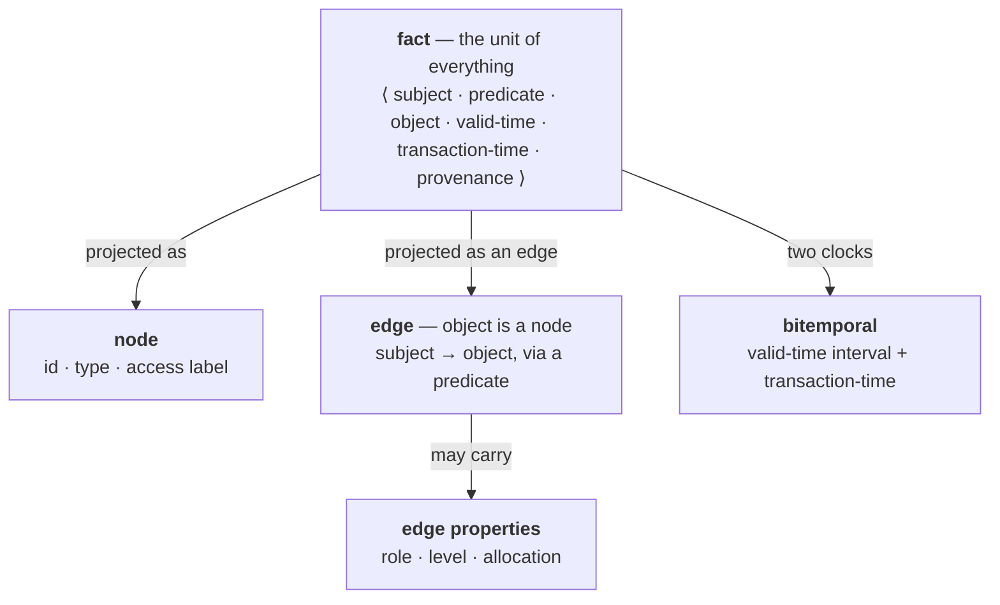

# StromaDB — Specification

StromaDB is a source-available, single-node **real-time GraphRAG engine optimized for LLMs**. It
fuses **meaning** (vectors), **structure** (a typed property graph), and **time** (bitemporal facts)
into one store, so an agent can retrieve relevant, structurally-correct, point-in-time context in
low-ms over a graph that a live stream keeps updating.

This document specifies the **data model**, the **JSONL ingest wire format**, the **query API**
(request/response shapes per operation), and the **consistency, access-control, and durability**
guarantees. It is the contract an integrator builds against. Companion: [`docs/ARCHITECTURE.md`](docs/ARCHITECTURE.md)
(engine internals) and [`docs/DECISIONS.md`](docs/DECISIONS.md) (rationale, limits, measurements).

---

## 1. Data model

Everything is a **fact**:

```
fact = ⟨ subject, predicate, object, valid-time, transaction-time, provenance ⟩
```

Nodes and edges are **projections** of this one unit:


```mermaid
flowchart TB
  F["<b>fact</b> — the unit of everything<br/>⟨ subject · predicate · object · valid-time · transaction-time · provenance ⟩"]
  F -->|projected as| N["<b>node</b><br/>id · type · access label"]
  F -->|projected as an edge| E["<b>edge</b> — object is a node<br/>subject → object, via a predicate"]
  E -->|may carry| P["<b>edge properties</b><br/>role · level · allocation"]
  F -->|two clocks| T["<b>bitemporal</b><br/>valid-time interval + transaction-time"]
```

- **Subjects** are node ids (`u64`). **Objects** are either another node (an edge) or a typed literal
  (int, float, text, bool).
- **Nodes and edges are projections of facts.** A node carries a `type` and an access-control
  `label`; an edge is a `(subject, predicate, object)` fact and may carry its own **edge properties**
  (a level, a role, an allocation) in a separate store. A fact may carry its own access `label`
  too, so one fact of a visible node can be hidden (§5).
- **Predicates are declared** in a bounded catalog. Each predicate fixes a **cardinality**
  (`one` = functional, last-writer-wins; `many` = a set), a **domain** type, a **range** (a node type
  or a literal type), and optional **relationship properties** (`symmetric`, `transitive`, `inverse`).
  The catalog is a **lightweight ontology** — types, domain/range, cardinality, relation properties —
  deliberately **without axioms or a reasoner**; the engine holds only minimal domain/range and
  cardinality validation.
- **Bitemporal.** Every fact has a **valid-time** (true-in-the-world interval) and a **transaction-time**
  (when it was recorded). Superseding a `one`-predicate closes the prior valid-time interval instead of
  destroying it, so history stays queryable and any instant can be read *as of* a valid-time (§4).
- **Provenance.** Each fact may name a `source`; reads can surface it and derive a coarse confidence
  from it (§3, `point`).

---

## 2. Ingest — JSONL wire format

Ingest is a batch of **newline-delimited JSON records**, one per line, applied in order. A batch is
**durable on return** (fsync'd to the changelog). Records are of these kinds:

### Schema records

```jsonc
{"type_def":   {"name": "Person"}}
{"source_def": {"name": "hr"}}
{"pred_def":   {"name": "name",       "cardinality": "one",  "domain": "Person", "range_value": "text"}}
{"pred_def":   {"name": "reports-to", "cardinality": "one",  "domain": "Person", "range": "Person"}}
{"pred_def":   {"name": "member-of",  "cardinality": "many", "domain": "Person", "range": "Team",
                "inverse": "has-member"}}
```

- `type_def.name` — register a node type.
- `source_def.name` — register a provenance source (optional; a `fact.source` also auto-registers).
- `pred_def` — declare a predicate. `cardinality` is `one` or `many` (default `many`) and is
  **load-bearing**: it cannot later be redefined to a different cardinality. `domain` is a type name.
  The range is a node type via `range` **or** a literal type via `range_value`
  (`text` | `int` | `float` | `bool`, default `text`). Relationship properties `symmetric` /
  `transitive` (bools) and `inverse` (the name of another predicate; may be a forward reference) are
  evaluated at query time by `expand` and are never materialized. `label_floor` (an access label,
  `0..=31`) is the least label every fact of the predicate carries (§5). It applies to existing
  facts as soon as it is declared or changed, without rewriting them. A re-sent `pred_def` that
  omits `label_floor` keeps the declared floor; `"label_floor": null` clears it.

### Data records

```jsonc
{"node": {"id": 1,  "type": "Person", "label": 1}}
{"node": {"id": 10, "type": "Team"}}
{"fact": {"subject": 1, "predicate": "name",       "object": {"text": "Ada"}, "source": "hr"}}
{"fact": {"subject": 1, "predicate": "reports-to", "object": {"node": 2},
          "valid_from": 1704067200, "source": "hr"}}
{"fact": {"subject": 1, "predicate": "member-of",  "object": {"node": 10}, "props": {"role": {"text": "lead"}}}}
{"fact": {"subject": 1, "predicate": "email",      "object": {"text": "ada@example.com"}, "label": 2}}
{"retract": {"subject": 1, "predicate": "member-of", "object": {"node": 10}}}
{"close": {"subject": 1, "predicate": "reports-to", "valid_from": 1704067200, "source": "hr"}}
```

- `node` — `id` (required); optional `type` (a declared type) and `label` (a `u64` ABAC bitmask, §5).
- `fact` — assert `(subject, predicate, object)`. `object` is a typed value (below). Optional
  `valid_from` / `valid_to` (epoch seconds; the valid-time interval, default `[0, ∞)`), `source` (a
  provenance name), `props` (edge properties, a map of name → typed value), and `label` (an
  access label `0..=31` on this fact, §5). Re-sending a fact with a different `label` appends a
  new version and so relabels it; an identical re-send is a no-op.
- `retract` — end a `many`-predicate membership (`subject, predicate, object`; optional `source`).
  Retracting an edge that is not present is a no-op (not counted). A `retract` on a `one`-predicate
  is an error: supersede the value by asserting a new one, or end it with `close`.
- `close` — end a `one`-predicate's value with no successor (`subject, predicate`; optional
  `valid_from`, default `0`, and `source`). The current value becomes absent, and an as-of read at or
  after `valid_from` returns nothing (reads before it still see the prior value) — regardless of
  arrival order. Errors on a `many`-predicate (use `retract`). A `close` may carry `label` like a
  fact; the close is then hidden along with the value it ends.

### Object / literal encoding

An `object` (and any `props` / `equals` value) is a single-key object naming its type:

```jsonc
{"node": 2}          // a reference to node 2 (an edge)
{"int": 42}
{"float": 3.5}
{"text": "Ada"}
{"bool": true}
```

An `int` is a 64-bit signed integer and a `float` is an IEEE 754 double (`f64`): a float is stored,
replayed, and compared with the full 64 bits, so `16777217.0` and `1234567.89` read back exactly as
ingested. An int never equals a float, but the two compare numerically under a range test.

### Named rules

A conformance rule (§3) can be stored by name for reuse:

```jsonc
{"rule_def": {"name": "manager-name-current", "rule": { /* see conformance */ }}}
```

---

## 3. Query API

A query is a JSON object whose `op` field names the operation. The same operations are exposed over
the HTTP surface (`stroma-serve`), the `stroma` CLI, and as MCP tools (`stroma-mcp`, where the tool
name is the `op`). Reads are **authz-scoped** (§5) and stamped with an `as_of` cut (§4).

### `schema`

Discover what is queryable.

```jsonc
// request
{"op": "schema"}
// response
{"predicates": [{"name": "reports-to", "card": "one",
                 "domain": "Person", "range": {"type": "Person"}, "label_floor": null}, …],
 "labels": [1, 2, …],
 "rules": ["manager-name-current", …]}
```

`labels` lists every access label in use: on nodes, on stored facts, and as a predicate's
`label_floor`.

### `rule`

Read back a stored rule's declaration (§2, named rules).

```jsonc
// request — one rule
{"op": "rule", "rule_name": "manager-name-current"}
// response — the rule JSON exactly as declared by its latest rule_def
{"name": "manager-name-current", "rule": {"subject_type": "Person", "required": {…}, "actual": "manager-name"}}
// request — every stored rule, sorted by name
{"op": "rule"}
// response
{"rules": [{"name": "manager-name-current", "rule": {…}}, …]}
```

An unknown `rule_name` is an error. Rules are schema-level, so no label mask applies (as with
`schema`).

The returned declaration uses the conformance rule shape, so it reads as described under
`conformance`. It may contain `required` and `distinct_from` hop paths, where a hop's `as_of`
names the anchor predicate on the subject. A banded rule has ordered first-match `cases` instead of
`required`. Conditions test `equals` or a numeric range (`gt`/`gte`/`lt`/`lte`, `between`) and may
carry their own `as_of` anchor.

### `lookup`

Resolve an external key to node ids: the nodes whose `one`-predicate equals a value, now or at a
valid-time instant.

```jsonc
// request — value is a bare scalar (a string is text) or {"text"|"int"|"float"|"bool"|"node": ..}
{"op": "lookup", "predicate": "issue-key", "value": "PROJ-123", "type": "Issue", "limit": 10}
{"op": "lookup", "predicate": "issue-key", "value": "PROJ-123", "valid_at": 1704067200}
// response — ascending by id; valid_at echoed for an as-of lookup
{"nodes": [{"id": 1005, "type": "Issue", "display": "Fix login"}], "truncated": false}
// batch — each item its own value and instant (valid_at defaults to the top-level one) …
{"op": "lookup", "predicate": "issue-key", "valid_at": 1704067200,
 "queries": [{"value": "PROJ-1"}, {"value": "PROJ-2", "valid_at": 1700000000}]}
// … or many values at one instant
{"op": "lookup", "predicate": "issue-key", "values": ["PROJ-1", "PROJ-2"]}
// batch response — one single-form answer per item, in request order
{"results": [{"nodes": [..], "truncated": false, "valid_at": 1704067200}, …]}
```

- Exact match on the current value, or with `valid_at` on the value in effect at that instant (as
  `point … valid_at`). `equals` is an alias of `value`. `limit` defaults to 10 and is capped at
  100 per answer.
- Post-authz: a node the mask hides is absent, and a hidden fact never matches. A hidden current
  row gives way to the latest visible one.
- A request takes exactly one of `value`, `queries` or `values`. A batch holds at most 1000 items
  and is answered from one snapshot.
- Cost: O(log n + candidates) per value through a reverse value index, where candidates are the
  nodes that ever held the value.

### `point`

Read the value(s) of a `(subject, predicate)`.

```jsonc
// request — current value
{"op": "point", "subject": 1, "predicate": "reports-to"}
// request — as-of a valid-time instant, and/or with a freshness reference
{"op": "point", "subject": 1, "predicate": "reports-to", "valid_at": 1704067200}
{"op": "point", "subject": 1, "predicate": "name", "now": 1720000000, "max_age": 2592000}
```

- A `one`-predicate returns `{"one": <value>}`; a `many`-predicate returns `{"many": [<value>, …]}`.
- `valid_at` reads the value **in effect at instant T** (valid-time as-of) rather than the latest write.
- For a **current** `one`-value, the response additively carries the winning version's `valid_from`,
  provenance, and a coarse confidence:

```jsonc
{"one": 2,
 "valid_from": 1704067200,
 "provenance": "hr",
 "confidence": {"tier": "high|medium|low", "corroboration": 2, "sources": 2, "age": 120}}
```

`tier` is `low` if the value has no source or is stale (`age > max_age`), else `high` if corroborated
by ≥ 2 distinct sources, else `medium`. `corroboration` / `sources` / `age` are the raw signals, so a
caller can apply its own policy. `age` appears only when `now` is supplied; `valid_from` and
`confidence` are **omitted** for an as-of (`valid_at`) or absent read, leaving the shape unchanged.
`valid_from` lets a writer compare an incoming event's timestamp against the current winner before
writing (late-arrival detection).

- For a **current** `one`-read whose winning version is a `close`, the response additively carries
  the close boundary:

```jsonc
{"one": null, "closed_from": 1704067200}
```

`closed_from` is the close's `valid_from` and appears only when the current winner is a close —
never for an as-of (`valid_at`) read, and never for a never-written key, whose response stays
exactly `{"one": null}`; when omitted the shape is unchanged. It distinguishes "ended by a close"
from "never written", so a writer can defend the close during late-arrival repair: a late fact
older than the close must not silently resurrect the ended value.

### `timeline`

Answer **"over which intervals / when was"** instead of "as of T": the full valid-time timeline of
a value — one predicate's own history, or a value *derived* through a chain of `one`-predicates
(the validity of a derived value is the **intersection of the contributing rows' intervals**).

```jsonc
// request — hops is a chain of one-cardinality predicates walked left→right from the subject
{"op": "timeline", "subject": 1, "hops": ["member-of", "manager-of"]}
// response — sorted, non-overlapping; valid_to null = still in effect
{"segments": [
  {"value": {"node": 10}, "valid_from": 1000, "valid_to": 3000},
  {"value": {"node": 12}, "valid_from": 3000, "valid_to": null}
]}
```

- Agrees with the point-wise composition at every instant: for any `T` inside a segment,
  `point … valid_at: T` composed along the same hops returns that segment's value; instants no
  segment covers read as absent. Supersessions split segments, a `close` ends one with no
  successor, and a late-arriving correction re-slices exactly as it re-answers as-of.
- Every intermediate hop value must be a node (a broken path derives nothing over that interval);
  the final value may be a node or a literal. Segment count is bounded by the contributing history
  rows.
- A non-empty answer also carries an additive **weakest-link `confidence`**: the minimum coarse
  tier over every `(node, predicate)` history the walk read (its support set), with the weakest
  support's raw signals and a `weakest` pointer naming the bottleneck hop. Optional `now` /
  `max_age` freshness inputs work as in `point`; an empty answer omits the field.

```jsonc
// appended to the response when segments is non-empty
{"confidence": {"tier": "low", "corroboration": 2, "sources": 2,
                "weakest": {"node": 100, "predicate": "part-of"}}}
```

### `expand`

One-or-multi-hop neighbourhood via a predicate, honouring its relationship properties.

```jsonc
// request
{"op": "expand", "subject": 1, "predicate": "member-of", "max_depth": 16}
// response
{"nodes": [10, 11, …]}
```

`symmetric` predicates traverse undirected, `inverse` follows the named reverse predicate, and
`transitive` walks a bounded closure (`max_depth`, default 16).

### `search`

Type-aware hybrid search: k nearest nodes of a type to a query vector, authz-scoped, optionally
1-hop expanded.

```jsonc
// request
{"op": "search", "type": "Doc", "vector": [0.12, …], "k": 10,
 "allowed_labels": 3, "expand": "mentions", "mode": "fresh"}
// response
{"ids": [7, 3, …], "scores": [0.91, …],
 "as_of": {"changelog": 10432, "vector": 10400}}
```

ANN candidates are filtered/reranked by graph type and structure, so an approximate index and a type
filter don't collapse recall. `mode` is `fresh` (each store at latest + a brute-force scan of the
un-indexed tail; the agent default) or `strict` (all stores at a single consistent watermark; §4).

### `conformance`

Evaluate a declared rule into a **deterministic verdict per subject**.

```jsonc
// request — inline rule, or {"rule_name": "manager-name-current"}
{"op": "conformance",
 "rule": {
   "subject_type": "Person",
   "scope":       {"predicate": "member-of", "equals": {"node": 10}},
   "required":    {"hops": [{"predicate": "reports-to"}, {"predicate": "name", "as_of": "review-time"}]},
   "actual":      "manager-name",
   "absent_when": {"predicate": "employment-status", "equals": {"text": "active"}}
 }}
// response
{"verdicts": [
  {"subject": 1, "verdict": "OK",             "kind": null,    "required": {"text": "Grace"}, "actual": {"text": "Grace"}, "as_of": 1704067200},
  {"subject": 2, "verdict": "MISMATCH",       "kind": "stale", "required": {"text": "Lin"},   "actual": {"text": "Ada"},   "as_of": 1706745600},
  {"subject": 5, "verdict": "ABSENT",         "kind": null,    "required": {"text": "Ivy"},   "actual": null,              "as_of": 1704067200},
  {"subject": 9, "verdict": "NOT_APPLICABLE", "kind": null,    "required": null,              "actual": null,              "as_of": null, "reason": "out_of_scope"}
]}
```

- `required.hops` is a path of `one`-predicates walked from each subject to derive an expected value;
  a hop may be read **as-of** a valid-time anchor named by the `as_of` predicate on the subject.
  Every hop but the last must reach a node. The last hop may read a node or a literal, as `name`
  does above, and the `actual` is compared with that value exactly as both are stored: equal text
  matches, and an int never equals a float. A literal's valid-time history decides `stale` versus
  `wrong` the same way a node's does. A rule whose path has a `many`-predicate hop, or a
  literal-valued hop before the last, can never resolve, so `conformance` and `conformance_watch`
  reject it with an error, as they do an unknown name.
- `distinct_from.hops` (optional) derives a value the actual must **differ** from — e.g. a
  self-approval ban is `{"hops": [{"predicate": "assigned-to"}]}`. A rule declares `required`,
  `distinct_from`, or both; each verdict carries the resolved `distinct` value when declared.
- The derived value is compared to the subject's `actual` predicate:
  - `OK` — present, equal to the `required` value (when declared), and different from the
    `distinct_from` value (when declared).
  - `MISMATCH` — present but unequal to `required`, or colliding with `distinct_from`; `kind`
    sub-classifies an equality mismatch via the valid-time history of the last as-of hop as
    `stale` (the `actual` value held that hop at some other valid-time, earlier or later) or
    `wrong` (it never did) — a must-differ collision holds *now*, so it is always `wrong`. An
    equality mismatch is only ever judged against a `required` value that was in effect at the
    anchor; when none was (see `required_unresolved`), the row is not a `MISMATCH` of any kind.
  - `ABSENT` — `actual` is missing where `absent_when` says it should exist.
  - `NOT_APPLICABLE` — the rule does not judge the subject. Every `NOT_APPLICABLE` row, and only
    such a row, carries a `reason`:
    - `out_of_scope` — the subject falls outside `scope`.
    - `no_matching_case` — a banded rule matched no `cases` entry.
    - `hidden_by_label` — the judgment read a fact the caller's `allowed_labels` hides (a fact
      whose label, or whose predicate's `label_floor`, is not allowed). The row carries no
      values. It says only that the verdict depends on facts the caller cannot read.
    - `required_unresolved` — `actual` is present but the required path resolves to no value (a
      hop along it has no value, its as-of anchor is missing, or no value was in effect at the
      anchor because the hop's history starts later or is closed over it), so equality cannot be
      judged. The row keeps its `actual`, `distinct`, `as_of` and `case` values. Missing data on
      the required path is never reported as a violation, and never as `stale`: an approval dated
      before the first recorded manager reads as "no history at `as_of`", not as a lapsed
      authority.

Precedence when the required path is unresolved: a missing `actual` is still `ABSENT` (when
`absent_when` holds) or `OK`, since absence does not depend on the expected value. A present
`actual` that collides with a resolved `distinct_from` value is still `MISMATCH` (`wrong`).
Otherwise it is `NOT_APPLICABLE` with `required_unresolved`. When the missing fact arrives, a
watched rule re-judges the subject incrementally, because the read that came up empty is part of
its support set.

Judgment is unfiltered by fact labels; the caller's mask is applied to each finished verdict. Any
verdict whose reads touch a fact the mask hides becomes `NOT_APPLICABLE` with `hidden_by_label`,
taking precedence over every verdict and every other reason except `unknown_subject` and
`not_subject_type`, which are decided from node attributes first. The check is conservative: a
hidden version anywhere in a read value's history withholds the row.

`subject: N` or `subjects: [N, …]` evaluates only those ids, in O(listed). The answer holds exactly
one row per distinct requested id, sorted by id. A visible subject of the rule's type is judged as
above. Any other id is still answered, as `NOT_APPLICABLE` with no values and one of two further
reasons:

- `not_subject_type` — the id names a visible node whose type is not the rule's `subject_type`.
- `unknown_subject` — the id names no typed node, or a node hidden from the caller by
  `allowed_labels`. A hidden node reads as unknown whatever its type, so the answer does not
  reveal that it exists.

`only: [verdict, …]` keeps those outcomes, and `offset` / `limit` page the kept rows. The response
adds `total` (rows kept by `only`), `returned`, `truncated` (rows remain after this page), `counts`
per verdict, and `reasons` per `NOT_APPLICABLE` reason, both over every row before `only` and
paging. `not_subject_type` and `unknown_subject` rows exist only in the explicit-subjects answer:
`conformance_watch` / `conformance_changes` maintain verdicts for subjects of the rule's type only,
and their rows carry the other reasons.

```jsonc
{"op": "conformance", "rule_name": "release-approval", "subjects": [1005, 10, 999999]}
// → {"verdicts": [
//      {"subject": 10,     "verdict": "NOT_APPLICABLE", "reason": "not_subject_type", …},
//      {"subject": 1005,   "verdict": "MISMATCH",       "kind": "wrong", …},
//      {"subject": 999999, "verdict": "NOT_APPLICABLE", "reason": "unknown_subject", …}],
//    "total": 3, "returned": 3, "truncated": false,
//    "counts": {"OK": 0, "ABSENT": 0, "MISMATCH": 1, "NOT_APPLICABLE": 2},
//    "reasons": {"out_of_scope": 0, "no_matching_case": 0, "required_unresolved": 0,
//                "not_subject_type": 1, "unknown_subject": 1, "hidden_by_label": 0}}
```

Conditions (`scope`, `absent_when`, and a case's `when`) test one `one`-predicate value of the
subject. Each has exactly one test:

- `equals` — the value equals the given object (`{"node": N}`, `{"int": …}`, or a bare scalar).
- a numeric range — `gt` or `gte` for the lower end, `lt` or `lte` for the upper end (either or
  both, so `{"predicate": "amount", "gt": 500000, "lte": 2000000}` is the band (500000, 2000000]),
  or `between: [lo, hi]` with both ends inclusive. Int and float values compare numerically.

A condition may name its own `as_of` anchor (an integer predicate on the subject); the value is then
read as-of that valid-time instant, like an as-of hop. A missing value, a non-numeric value under a
range, or a missing anchor leaves the condition **unsatisfied** — the same as an equality condition
over a missing value. An unreadable `scope` therefore yields `NOT_APPLICABLE`, and an unreadable
`absent_when` does not turn a missing `actual` into `ABSENT`.

A banded rule replaces `required` with ordered `cases`, evaluated first-match. The first case whose
`when` holds supplies the required path; a case without `when` always holds, so it serves as the
default. No match is `NOT_APPLICABLE` with `reason` `no_matching_case`. Each verdict reports the matched `case` index (null for a
rule without cases):

```jsonc
{"subject_type": "Request",
 "cases": [
   {"when": {"predicate": "amount", "lte": 500000, "as_of": "approved-at"},
    "required": {"hops": [{"predicate": "requester"}, {"predicate": "member-of"}, {"predicate": "manager-of"}]}},
   {"when": {"predicate": "amount", "gt": 500000, "lte": 2000000, "as_of": "approved-at"},
    "required": {"hops": [{"predicate": "requester"}, {"predicate": "member-of"}, {"predicate": "parent"}, {"predicate": "manager-of"}]}},
   {"required": {"hops": [{"predicate": "requester"}, {"predicate": "member-of"}, {"predicate": "parent"}, {"predicate": "parent"}, {"predicate": "manager-of"}]}}
 ],
 "actual": "approved-by"}
```

Here a request whose amount was raised past a band after its approval is still judged by the band
in effect at `approved-at`; without the `as_of` anchors it is judged by its current amount.

This composes a multi-hop, as-of check the caller would otherwise assemble by hand — deterministically,
post-authz, with no reasoner.

### `conformance_watch` / `conformance_changes`

Keep a **stored** rule's verdicts live instead of re-paying a full evaluation per poll: after a
watch, every ingest updates the verdict map **incrementally** — only the subjects whose inputs
changed are re-judged (support-set tracking: a judgment records every `(node, predicate)` it read,
including reads on intermediate nodes of the derived paths, so one upstream write re-judges exactly
the subjects whose paths run through it) — and journals the changes.

```jsonc
// watch (idempotent): full current verdicts + a cursor
{"op": "conformance_watch", "rule_name": "release-approval"}
// → {"verdicts": [ …same shape as conformance… ], "cursor": 41}

// poll: the verdict changes since a cursor, as old→new pairs
{"op": "conformance_changes", "rule_name": "release-approval", "cursor": 41}
// → {"changes": [ {"subject": 1003, "old": {…"verdict":"ABSENT"…}, "new": {…"verdict":"OK"…}} ],
//    "cursor": 44}
```

- `old: null` = the subject just entered the rule's subject type; `new: null` = it left it.
- The maintained map always equals a full one-shot `conformance` evaluation (property-tested), and
  the update cost is O(touched) per ingest, not O(subjects) per poll.
- The change journal is bounded: a cursor that has fallen behind it gets `{"resync": true}` —
  re-watch (or read the full verdicts) instead of trusting a gap.
- `allowed_labels` filters both surfaces per caller, exactly like `conformance` (maintenance itself
  is unfiltered; visibility is decided at read time). Each side of a change is masked as of its own
  judgment, so a write that only relabels a fact a verdict read shows up as a change to or from
  `hidden_by_label` for a caller whose mask hides it.
- The watch is **in-memory**: re-watch after a process restart. Re-declaring the rule (`rule_def`
  with the same name) invalidates its watch — re-watch to pick up the new declaration. Changing a
  predicate's `label_floor` invalidates every watch, since it changes what each caller may see
  without writing a fact.

### `completeness`

Report, per node of a type, the required predicates that are **absent**.

```jsonc
// request
{"op": "completeness", "type": "Issue", "required": ["assigned-to", "due-date"]}
// response
{"incomplete": [{"node": 12, "missing": ["due-date"]}, …]}
```

Deterministic (sorted by node id, `missing` in request order), authz-scoped; nodes with every required
predicate present are omitted.

### `edge_props`

Read the properties on a specific edge.

```jsonc
// request
{"op": "edge_props", "subject": 1, "predicate": "member-of", "object": {"node": 10}}
// response
{"props": {"role": "lead"}}
```

Post-authz like `point`: a subject outside the caller's node labels answers `denied`, and the
properties of an edge whose versions are all hidden by fact labels are absent.

### `stats` / `ingest`

- `{"op": "stats"}` → engine counters: durable changelog head, schema/embedding counts, storage bytes,
  nodes per node label (`labels`) and stored fact versions per fact label (`fact_labels`).
- Ingest (§2) is submitted as a JSONL batch and returns
  `{"defs": D, "nodes": N, "facts": F, "retracts": R, "closes": C, "durable_head": H}`, durable on
  return. `retracts` counts only retracts that removed a present edge.

### Change feed

What each durable batch touched, for a client that keeps a view current without re-reading it.
Served over HTTP only; the cursor is a durable head.

```jsonc
// long-poll: waits up to ~20 s for the head to pass `since`
GET /events?since=41&changes=1[&allowed_labels=3]
// → {"head": 44, "changes": [{"node": 7, "type": "Person", "predicates": ["name", "member-of"], "new": true}]}

// server-sent events: one event per batch, same JSON; `id:` is the batch head
GET /events/stream?since=41[&allowed_labels=3]
// id: 44
// data: {"head": 44, "changes": [ … ]}
```

- A change names a node, its type and the predicates the batch wrote on it (facts, closes,
  retracts, edge properties); `new` marks a node that got its first type or label. Values are
  never included. `GET /events?since=N` without `changes` still answers only `{"head"}`.
- The long-poll merges every batch after the cursor into one entry per node. The stream sends
  one event per batch, starts from the current head when `since` is absent (announced by a first
  event with no changes), resumes from `Last-Event-ID`, sends a comment line after 15 s of silence
  and ends after 5 minutes so the client reconnects under its current credentials.
- Post-authz at read time, like every read: `allowed_labels` (capped by a token's labels) hides
  the changes of a node outside the caller's node labels. A predicate is listed only when a row the
  batch wrote on it is visible under the predicate's floor and the row's label; a retract counts
  the rows of the element it removed. A change with nothing visible left is dropped.
- The journal is in memory and bounded (4,096 node changes; a batch touching more than 1,024
  nodes is not journaled). A cursor it cannot answer exactly gets `{"resync": true}` with the
  current head: one older than the retained window or than the process start, one whose window
  holds an unjournaled batch, or one ahead of the head after a reset. Re-read the view and continue
  from `head`.

---

## 4. Time & consistency

- **Two clocks.** *Valid-time* (true-in-the-world) is what `valid_from` / `valid_to` set and what
  `valid_at` / a conformance `as_of` read against. *Transaction-time* is the recorded order and the
  MVCC basis.
- **`as_of` version vector.** Every read is stamped with a cut across the underlying stores — the
  changelog sequence number and the vector-index watermark — exposing cross-store skew rather than
  hiding it.
- **Read modes.** `strict` pins all stores to a single consistent watermark (fully consistent,
  excludes the newest un-indexed tail — for audit/repro). `fresh` takes each store at its latest plus a
  bounded brute-force scan over the un-indexed tail, so a structurally-present match is never dropped
  because an index lagged (the agent default).
- **Snapshot reads.** Reads run over a pinned, immutable snapshot; a concurrent streaming ingest never
  stalls a reader (lock-free), and each read is snapshot-isolated.

---

## 5. Access control

- Every request carries an **end-user principal**; an agent queries **on behalf of** that principal
  (delegation), never with ambient authority.
- **Authz is injected at the head** of every query, so downstream operators — including cardinality
  and search — see only authorized facts. Cardinality/counting is **post-authz** (a count must not
  leak the existence of facts the caller can't see).
- Access is **ABAC label-based**: a node's `label` is a bitmask, and a request's `allowed_labels`
  bitmask scopes what it may read (default: all).
- **Per-fact labels.** A fact may carry its own `label`, and a predicate may declare a
  `label_floor`. A fact's effective label is `max(label_floor, label)`; the caller sees the fact
  when `allowed_labels` allows both the floor and the fact's own label, which for tier masks
  (every label up to some level) is exactly "the effective label is allowed". Labels are numbered
  by sensitivity, `0..=31`. The node stays visible under its own node label; only the hidden fact
  is gone. Every read answers as the same read over a store in which the hidden facts were never
  written: a hidden current value gives way to the latest visible one, a hidden edge is not
  traversed by `expand` and drops from graph views, hidden versions drop from `timeline` and as-of
  reads, `lookup` and `find` cannot match a hidden value, a node's display name falls back past a
  hidden display predicate, and `retrieve_context` neither returns nor assembles hidden content.
  The floor is resolved at read time, so declaring or changing it applies to existing facts
  immediately. Embeddings are per node and follow the node label only.
- **Namespaces** (the serving layer) sit outside labels: one server can front several databases,
  the `--db` directory as `default` plus ordinary database directories at `<db>/ns/<name>/`,
  addressed by the path prefix `/ns/<name>/`. Namespaces share nothing but the process — no type,
  predicate, node id, fact or embedding crosses between them, and no query spans two. Auth and
  tokens are server-wide, so a namespace is an isolation boundary for data, not for credentials;
  per-tenant credentials and crash isolation come from separate processes. The engine itself stays
  one database per directory.
- Subject-addressed reads (`point`, `expand`, `timeline`) are post-authz too: a subject outside the
  caller's labels answers `denied` (point/expand) or empty (timeline), and node-valued answers
  outside them read as absent — a direct id probe must not leak what a search would hide.
- **Named API tokens** (the serving layer): each registered token carries a client name, an optional
  `allowed_labels` cap, and an optional read-only bit. The cap is **intersected** with the request's
  own `allowed_labels` (a client can narrow itself, never widen); writes arriving on a named token
  have unset `source` fields stamped with the token's name, so *which client asserted a fact* is
  queryable provenance like any other; read-only tokens get a clear error on any write. The same
  tokens govern HTTP and MCP. The single legacy `--api-token` remains an unnamed, unrestricted entry.

---

## 6. Durability & determinism

- **Durable changelog.** Writes append to a framed, checksummed write-ahead log with group-commit
  fsync; the changelog is the version authority. Cold start replays the committed prefix and drops a
  torn tail via checksum (0 committed-data loss).
- **Deterministic convergence.** Each `(subject, predicate)` state is a join-semilattice
  (`one` = last-writer-wins register under a total `(tx-time, source, write-seq)` order; `many` = a
  set), so an out-of-order, multi-source, redelivered stream folds to the **same** state regardless of
  arrival order — the basis for deterministic replay and audit.
- **Derived stores carry watermarks.** The vector index and cold columnar tier each record how far
  they have caught up to the changelog; a read never returns a dangling reference (watermark ≤
  changelog head invariant).

---

## 7. Interfaces

- **`stroma`** — CLI: ingest JSONL, run query ops, inspect stats.
- **`stroma-serve`** — HTTP surface + a built-in web console (graph explorer, type-aware search, node
  inspector).
- **`stroma-mcp`** — a Model Context Protocol server over stdio: an LLM discovers the schema and calls
  the operations above as tools.

---

## 8. Limits (v1)

- **Single node, single-writer serving.** Not distributed / multi-region.
- **Bounded scale.** Sized for a single organization's graph (millions–tens-of-millions of nodes,
  GB-class hot set); over the envelope it degrades latency / sheds load rather than failing silently.
- **No inference on the hot path.** Reasoning is the caller's (the LLM's); the engine is deterministic
  and stores no model. Any bidirectional/derived maintenance is batch, not per-read.
- **Embeddings are received, not computed.** Vectors are supplied by the caller; a model/dimension
  change runs a new versioned index in parallel (mixed versions are rejected).
- **No schema reasoner.** Only minimal domain/range and cardinality validation — no OWL /
  description-logic entailment.
